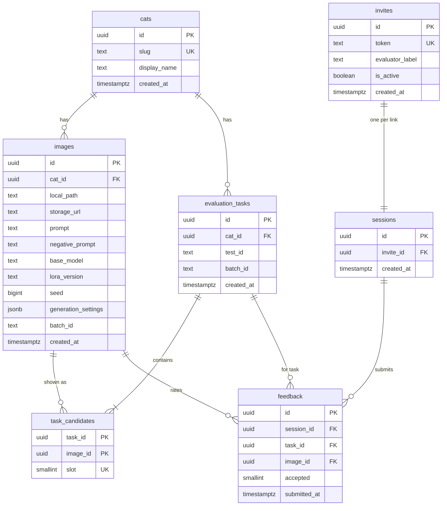

# Phase 0 data model

Entity-relationship diagram for the Supabase schema in [`migrations/20260819200000_init.sql`](migrations/20260819200000_init.sql).

## ER diagram



Note: `sessions.invite_id`, `cats.slug`, and `invites.token` are UNIQUE in SQL; Mermaid allows only one of `PK` / `FK` / `UK` per attribute line, so those uniques are documented here and in the relationships table.

## Relationships

| From | To | Cardinality | Notes |
| --- | --- | --- | --- |
| `cats` | `images` | 1:N | Each image belongs to one cat |
| `cats` | `evaluation_tasks` | 1:N | Each task evaluates one cat |
| `invites` | `sessions` | 1:1 | One session per invite link (`invite_id` UNIQUE) |
| `evaluation_tasks` | `task_candidates` | 1:4 | Up to four slots per task |
| `images` | `task_candidates` | 1:N | Same image can appear in multiple tasks later |
| `sessions` + `evaluation_tasks` + `images` | `feedback` | N:1 each | UNIQUE `(session_id, task_id, image_id)` |

## Review flow

```text
invite (private link)
  → session (1 per invite)
    → feedback (4 rows per submit: accepted 0/1)
      ← tied to evaluation_task + image

evaluation_task
  → task_candidates (slot 1–4)
    → images (with generation provenance)
      ← cat
```

Feedback is append-only: each submission writes one row per candidate image. Resubmit for the same session and task is blocked by the unique constraint.
