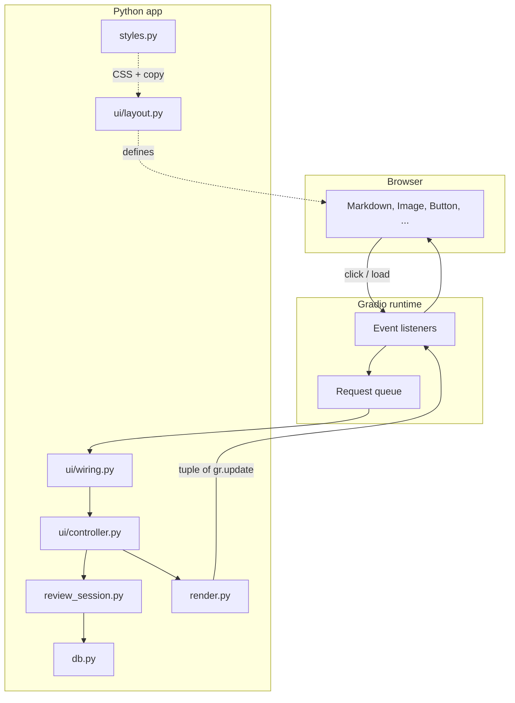
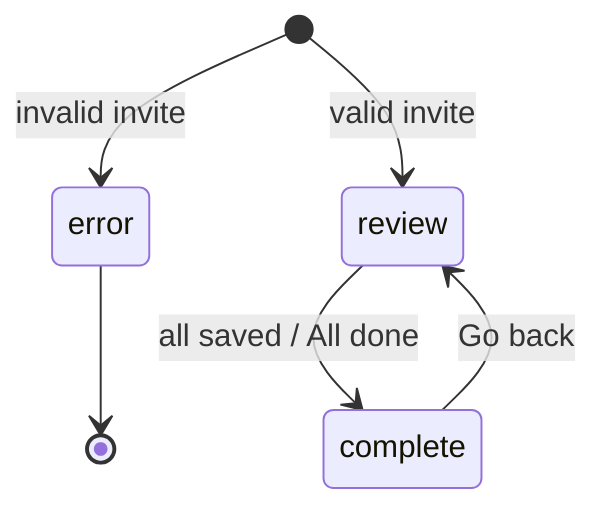
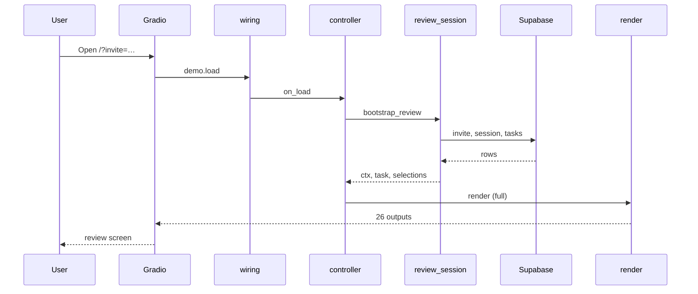
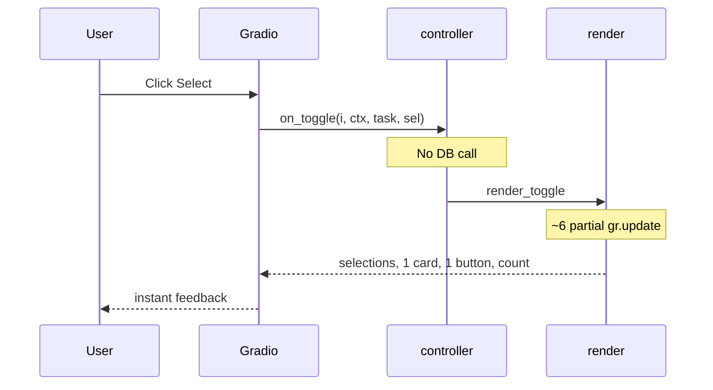
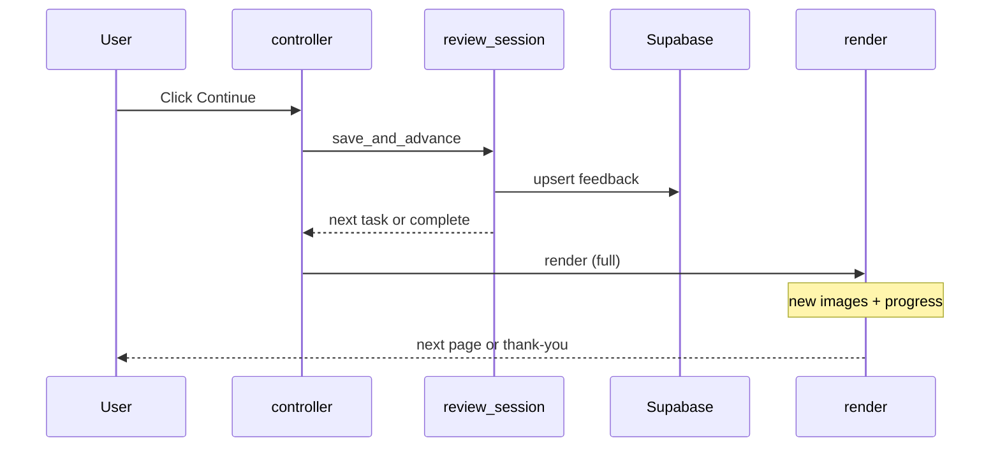
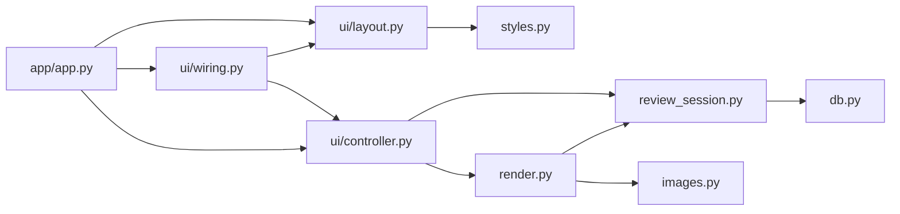

# Gradio frontend mental model

How to think about the Phase 0 cat image review UI. This doc is for anyone changing layout, behavior, or styling without getting lost in Gradio's event model.

Related docs:

- [Phase 0 data model](data-model.md) — Supabase entities the UI reads/writes
- UX copy and visual spec — product-facing; keep in sync when changing labels or flows

---

## One-sentence summary

**Gradio is not a client-side SPA.** The browser shows widgets; Python owns state. Every click sends state to the server, Python runs a handler, and the handler returns a batch of component updates that Gradio pushes back to the browser.

---

## Architecture at a glance

> **Interactive diagram:** open [gradio-frontend-architecture.canvas.tsx](/Users/kfl/.cursor/projects/Users-kfl-p-cfy/canvases/gradio-frontend-architecture.canvas.tsx) beside this chat for layer flow, screen states, and event sequences.



### Layers and responsibilities

| Layer | Module(s) | Responsibility |
|-------|-----------|----------------|
| **Entry** | `app/app.py`, root `app.py` | Build and launch `gr.Blocks` |
| **Layout** | `app/ui/layout.py` | Declare components (`ReviewUI`) — no business logic |
| **Wiring** | `app/ui/wiring.py` | Connect events → controller methods |
| **Controller** | `app/ui/controller.py` | Translate events into session actions + render calls |
| **Session** | `app/review_session.py` | Review rules: bootstrap, save, navigate, screen state |
| **Render** | `app/render.py` | Map `(ctx, task, selections)` → `gr.update(...)` dict |
| **Data** | `app/db.py`, `app/models.py` | Supabase reads/writes |
| **Presentation** | `app/styles.py`, `app/images.py` | CSS, copy strings, image path resolution |

**Rule of thumb:** if it touches Supabase or “what should happen when the user continues,” it belongs in **session** or below. If it only changes button text or border color, it belongs in **render** or **styles**. If it adds a new button, start in **layout**, then **wiring**, then **controller**.

---

## Core state: the “triple”

Three `gr.State` values hold everything the UI needs between events:

| State | Python type | Meaning |
|-------|-------------|---------|
| `ctx` | `ReviewContext` | Session identity, which screen, progress, errors |
| `task` | `EvaluationTask \| None` | Current page: cat name + 4 candidates |
| `selections` | `list[bool]` | Which of the 4 images are accepted (length 4) |

`ReviewContext` is the navigation and session envelope:

```python
@dataclass
class ReviewContext:
    invite_token: str
    evaluator_label: str
    session_id: str
    task_ids: list[str]              # ordered list of evaluation task IDs
    completed_task_ids: set[str]     # cached from DB; updated on save
    current_index: int               # index into task_ids
    screen: str                      # "error" | "review" | "complete"
    error_message: str
    status_message: str
```

Gradio persists these on the server for the browser tab’s session. They are **inputs and outputs** of almost every handler: read the triple in, return an updated triple out (plus visual updates).

---

## Screens

The app has three logical screens, driven by `ctx.screen`:

| Screen | Visible region | Typical trigger |
|--------|----------------|-----------------|
| **error** | `error_panel` | Missing/invalid invite, DB failure, no tasks |
| **review** | `review_screen` | Normal flow — 2×2 grid, nav buttons |
| **complete** | `complete_screen` | All tasks submitted or user taps “All done” |

`ReviewRenderer.build_updates()` is the single place that decides visibility (`review_screen` vs `complete_screen` vs error) and fills in content for the active screen.



---

## Diagrams

### Layer flow (static)

See mermaid diagram in [Architecture at a glance](#architecture-at-a-glance) above.

### Screen state machine

`ctx.screen` is `"error"`, `"review"`, or `"complete"`. Only one main region is visible at a time (see state diagram in [Screens](#screens)).

### Sequence: page load



### Sequence: Select toggle (fast path)



### Sequence: Continue



### File dependency (compile-time)



---

## Event → update pipeline

Every interaction follows the same pipeline:

```
User action
  → wiring (which handler?)
  → controller (call session logic?)
  → renderer (build gr.update dict)
  → pack into tuple aligned with OUTPUT_KEYS
  → Gradio applies updates to components
```

### Example: page load

1. Browser opens `/?invite=invite-reviewer-1-…`
2. `demo.load` → `controller.on_load`
3. `bootstrap_review(store, invite_token)` resolves invite, session, first task
4. `renderer.render(ctx, task, selections)` → 26 values (one per `OUTPUT_KEYS` entry)
5. Images get file paths; buttons get labels; `review_screen` becomes visible

### Example: Select toggle (fast path)

1. User clicks **Select** on candidate 2
2. `controller.on_toggle(1, …)` flips `selections[1]`
3. **`render_toggle`** — not full `render` — updates only:
   - `selections`, `ctx`
   - card 1 border classes, button 1 label/classes
   - `accepted_count`, cleared `status_message`
4. Images and progress are **unchanged** (`gr.update()` with no args = skip)

This fast path exists because re-sending four images and hitting Supabase on every toggle felt slow. Toggles are pure local state until **Continue**.

### Example: Continue

1. `save_and_advance` writes feedback to Supabase, adds `task.id` to `completed_task_ids`
2. Loads next task (or switches to `complete` screen)
3. Full `render` — new images, progress dots, nav button visibility

---

## OUTPUT_KEYS: the render contract

`render.py` defines a fixed ordered list of output slots:

```python
OUTPUT_KEYS = (
    "ctx", "task", "selections",
    "error_panel", "review_screen", "complete_screen",
    "cat_heading", "progress",
    "image_0" … "image_3",
    "card_0" … "card_3",
    "select_0" … "select_3",
    "accepted_count", "status_message",
    "primary_btn", "prev_btn", "all_done_nav_btn", "all_done_extra_btn",
)
```

`ReviewUI.build()` registers components under the same keys. `ReviewRenderer.pack()` turns a partial dict into a tuple:

- Key present → use that `gr.update(...)` or state value
- Key absent → `gr.update()` (no change)

**Adding a new visible component** requires:

1. Add the widget in `layout.py`
2. Add a key to `OUTPUT_KEYS`
3. Register it in `ReviewUI._components`
4. Set it in `build_updates()` (and optionally a toggle-specific path)

Skipping a step causes silent misalignment (updates applied to the wrong component).

---

## ReviewUI: component registry

`ReviewUI` is a dataclass holding references to every Gradio component plus helpers:

- `state_inputs` → `[ctx, task, selections]` passed into handlers
- `outputs` → components in `OUTPUT_KEYS` order passed to every event

Layout code runs inside `with gr.Blocks()` context managers. Components created there auto-register with Gradio; we also keep explicit references for wiring.

Static copy (button labels, headings) lives in `styles.py` so layout stays declarative and i18n can eventually swap strings in one place.

---

## Gradio concepts worth internalizing

### Blocks, not Interface

We use `gr.Blocks()` exclusively. Layout is nested `Column` / `Row`; behavior is event listeners. There is no single `fn=` entrypoint like the simple `gr.Interface` API.

### Events are the dataflow graph

```python
button.click(fn=handler, inputs=[...], outputs=[...])
```

- **inputs** — current values from state/components
- **outputs** — what the handler may update
- Handler return value must match output count (or use dict returns — we use tuples via `pack()`)

### `gr.update()` vs new components

To change a component’s value *or* properties (visibility, CSS classes), return `gr.update(value=…, visible=…, elem_classes=…)`. Do not reconstruct `gr.Button(...)` on every event unless you intend to replace the component entirely.

### `gr.State` is server-side

State is not in the URL (except `invite` read once on load). Refreshing the page re-runs `bootstrap_review`. In-progress selections on the current page are lost on refresh unless already saved.

### CSS and theme

Custom CSS is in `styles.py` and passed to `launch(css=CUSTOM_CSS, …)` from root `app.py`. Gradio 6 prefers theme/CSS on `launch()`, not on `Blocks()`.

---

## File map (quick reference)

```
app.py                    # HF Space entry: create_app().launch(...)
app/
  app.py                  # create_app() factory
  ui/
    layout.py             # ReviewUI.build()
    controller.py         # ReviewController handlers
    wiring.py             # wire_review_events()
  render.py               # ReviewRenderer, OUTPUT_KEYS
  review_session.py       # ReviewContext, bootstrap, save, navigate
  styles.py               # CUSTOM_CSS, user-facing strings
  db.py                   # SupabaseReviewStore
  images.py               # local_path → filesystem path for gr.Image
```

---

## Where to change common things

| Goal | Start here |
|------|------------|
| New button or layout section | `ui/layout.py` → `wiring.py` → `controller.py` → `render.py` |
| Change Continue / save behavior | `review_session.py` (`save_and_advance`, etc.) |
| Change error messages | `review_session.py` (message text) + `render.py` (`_status_update` styling) |
| Change labels / instructions | `styles.py` |
| Change colors, spacing, card borders | `styles.py` (`CUSTOM_CSS`) |
| Change which tasks load | `review_session.py` (`PHASE0_TEST_PREFIX`, `_review_tasks`) |
| Speed up an interaction | Prefer partial updates (`render_toggle` pattern) over full `render` |
| Swap data store in tests | Pass a mock `SupabaseReviewStore` into `create_app(store=…)` |

---

## Testing and injection

`create_app(store: SupabaseReviewStore | None = None)` accepts an optional store. Tests can pass a fake store and invoke controller methods directly without launching a server:

```python
controller = ReviewController(fake_store, ReviewRenderer(fake_store))
result = controller.on_toggle(0, ctx, task, [False, False, False, False])
```

For full UI tests, run `python app.py` locally with a valid `?invite=` query param.

---

## Performance notes

| Action | DB | Images resent | Notes |
|--------|----|--------------|-------|
| Load | Yes | Yes | Bootstrap + first task |
| Select toggle | No | No | `render_toggle` only |
| Continue | Yes (save) | Yes | Full render for next page |
| Previous | Maybe | Yes | Reloads saved selections from DB |

`completed_task_ids` on `ReviewContext` avoids repeated Supabase calls when rendering progress dots and “All done” visibility.

---

## Future-friendly hooks

**i18n (not implemented):** move strings from `styles.py` into locale JSON; add `locale` on `ReviewContext`; resolve in `ReviewRenderer`. Replace English prefix checks in `_status_update` with stable status codes.

**Phase 1+ images:** `images.py` today resolves `local_path` on disk. Bucket URLs would extend that module; layout and render stay the same if `image_display_value` still returns something `gr.Image` accepts.

---

## Mental checklist before opening a PR

1. Does session logic stay free of Gradio imports? (`review_session.py` should remain framework-agnostic.)
2. Does every new output have an `OUTPUT_KEYS` entry and a layout registration?
3. For frequent interactions, can you skip unchanged components (`gr.update()` / `render_toggle`)?
4. Did you update copy in `styles.py` rather than hardcoding in layout or render?
5. For behavior changes, does the three-screen model (`error` / `review` / `complete`) still hold?

---

## Comparison to familiar patterns

| You might expect… | In this Gradio app… |
|-------------------|---------------------|
| React component tree with local `useState` | Server-owned `gr.State`; browser is mostly a view |
| REST API called from frontend JS | Python handlers call Supabase directly |
| Redux store | `(ctx, task, selections)` triple + `ReviewRenderer` |
| CSS modules / styled-components | Global `CUSTOM_CSS` targeting Gradio class names |
| Client router | `ctx.screen` + `current_index`; no URL routes per page |

The useful analogy is **server-rendered forms with HTMX-like partial updates**, except Gradio generates both the form and the update wire protocol.
